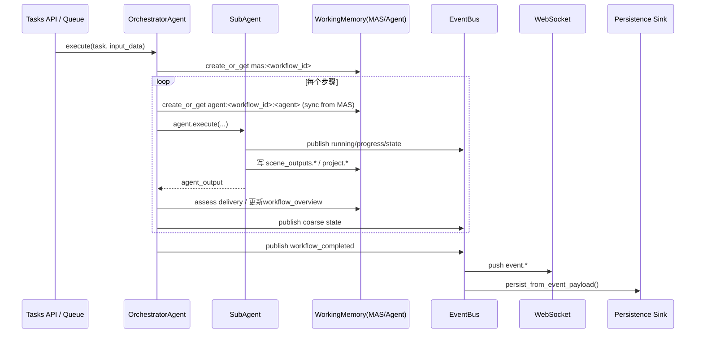
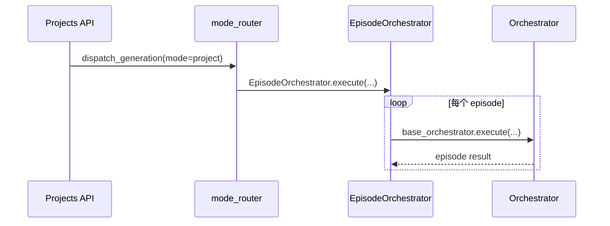

# Multi-Agent 通信技术文档

更新时间：2026-03-02  
状态：historical reference（pre-four-layer vocabulary）  
适用范围：旧版 Orchestrator + WorkingMemory + EventBus 通信实现快照，不再作为当前 `single-episode harness` 顶层层级术语来源

注意：

- 本文档保留为历史通信实现参考。
- 其中把 `OrchestratorAgent / EpisodeOrchestratorAgent` 直接称为“控制面（Control Plane）”的口径，已不再代表当前正式架构。
- 当前顶层层级术语以 [single_episode_harness_architecture_20260311.md](/mnt/d/code/agent/Opensource/vertical_application/short-video-maker/docs/architecture/single_episode_harness_architecture_20260311.md) 为准。
- 术语对齐说明见 [mas_architecture_alignment_note_20260323.md](/mnt/d/code/agent/Opensource/vertical_application/short-video-maker/docs/architecture/mas_architecture_alignment_note_20260323.md)。

## 1. 文档目标与边界

本文聚焦本项目 **多智能体（MAS）通信机制** 的工程实现，回答四个问题：

1. Agent 之间如何协作与传递控制权
2. 跨 Agent 数据如何共享、读取、校验
3. 运行状态如何对外通知（WebSocket/持久化）
4. 出错后如何保证可观测与可恢复

本文不展开模型 prompt 细节、单个工具内部算法，只描述通信与编排相关的技术实现。

---

## 2. 总体通信模型

当前系统采用 **中心化分层通信**，不是 Agent 点对点直连：

1. **控制面（Control Plane）**  
   `OrchestratorAgent` / `EpisodeOrchestratorAgent` 统一调度子 Agent，子 Agent 不直接调用其他 Agent。  
   关键代码：`backend/app/agents/orchestrator.py`、`backend/app/agents/episode_orchestrator.py`

2. **数据面（Data Plane）**  
   通过 `WorkingMemoryService` 管理两类作用域：
   - MAS 共享黑板：`mas:<workflow_id>`
   - Agent 私有工作区：`agent:<workflow_id>:<agent_name>`  
   关键代码：`backend/app/agents/utils/memory_helpers.py`、`backend/app/agents/memory/short_term/service.py`

3. **事件面（Event Plane）**  
   Agent/Orchestrator 发布统一 `Event` 到 `EventBus`，由监听器分发到 WebSocket 与持久化 sink。  
   关键代码：`backend/app/events/*`、`backend/app/services/event_handlers.py`

4. **客户端面（Client Plane）**  
   WebSocket 以 `task_id` 为订阅维度广播实时状态。  
   关键代码：`backend/app/services/websocket.py`、`backend/app/api/v1/endpoints/websocket.py`

---

## 3. 关键组件与职责

### 3.1 编排器层

- `OrchestratorAgent`
  - 定义执行顺序：`concept -> script -> image -> video -> voice -> composer -> audio -> quality`
  - 启动前基于能力路由构建 `activation_pool`，动态裁剪本次可激活 Agent 集合
  - 每步创建/同步 Agent scope WM
  - 调用 `agent.execute(...)`
  - 依据 MAS 交付事实进行 repeat/halt 决策（不覆盖 preflight 激活池路由）
  - 发布阶段性与完成事件

- `EpisodeOrchestratorAgent`
  - Project 模式下按集（episode）循环
  - 每集仍复用 `OrchestratorAgent` 的 1 分钟流水线

参考：
- `backend/app/agents/orchestrator.py:125-135`
- `backend/app/agents/orchestrator.py:244-259`
- `backend/app/core/mode_router.py:42-69`

### 3.2 Agent 基类层

- `BaseAgent.execute()`
  - 建立 `ExecutionState`（运行态上下文）
  - 发布 `running/completed/failed` 状态事件
  - 发布进度事件
  - 执行 `_execute_impl`

- `ReActAgent`
  - 从 Agent WM 读取 `facts + obs_records` 构建迭代上下文
  - PLAN 产出 tool calls，ACT 执行工具，OBS 写回 `obs_records`
  - 不依赖硬编码 pipeline 状态字段

参考：
- `backend/app/agents/base.py:439-625`
- `backend/app/agents/react_agent.py:83-117`
- `backend/app/agents/utils/context_manager.py:29-80`
- `backend/app/agents/utils/wm_obs.py:18-83`

### 3.3 记忆层（共享黑板）

- 作用域命名：
  - MAS：`mas:<workflow_id>`
  - Agent：`agent:<workflow_id>:<agent_name>`
- Orchestrator 每步把 MAS 视图同步到 Agent 工作区（深拷贝键值）
- 跨 Agent 共享事实只写 MAS；Agent scope 主要承载迭代上下文与观察记录

参考：
- `backend/app/agents/utils/memory_helpers.py:18-27`
- `backend/app/agents/memory/short_term/service.py:45-81`
- `backend/app/agents/memory/short_term/builder.py:48-105`

### 3.4 事件层

- `publish_event()` 封装统一事件元数据（task/workflow/agent/iteration/scene 等）
- `InMemoryEventBus` 进程内 pub/sub，带 retry 与 dead-letter
- `NotificationListener` -> WebSocket 推送
- `PersistenceListener` -> 持久化 sink

参考：
- `backend/app/events/publisher.py:7-43`
- `backend/app/events/bus.py:26-109`
- `backend/app/events/listeners.py:42-105`
- `backend/app/main.py:43-53`

---

## 4. 通信通道矩阵

| 通道 | 生产者 | 消费者 | 传输方式 | 主要负载 |
|---|---|---|---|---|
| 控制调用 | Orchestrator | SubAgent | 进程内 async 方法调用 | `task`, `input_data`, `execution_order` |
| 共享事实 | 各 Agent / Orchestrator | 各 Agent / Orchestrator | WorkingMemory 读写 | `scene_outputs.*`, `project.*`, `workflow_overview` |
| 运行事件 | BaseAgent/Orchestrator | EventBus Listeners | InMemory Pub/Sub | `EventKind.PROGRESS/STATE/ARTIFACT/ERROR` |
| 实时通知 | NotificationListener | 前端 WS 客户端 | WebSocket broadcast | `event.*` 消息 envelope |
| 异步落库 | PersistenceListener | DataPersistenceService | 监听器 sink 回调 | 场景/资源最小投影 |

---

## 5. 端到端通信时序

### 5.1 Quick 模式



关键代码链路：
- 入口：`backend/app/services/task_queue.py:124-140`
- 步骤执行：`backend/app/agents/orchestrator.py:244-354`
- 完成事件：`backend/app/agents/orchestrator.py:740-763`

### 5.2 Project 模式



关键代码：
- `backend/app/api/v1/endpoints/projects.py:550-557`
- `backend/app/core/mode_router.py:52-60`
- `backend/app/agents/episode_orchestrator.py:107-147`

---

## 6. 核心数据契约

### 6.1 工作流标识与作用域

- `workflow_id` 默认使用 `task.task_id`
- scope 规则：
  - `mas:<workflow_id>`
  - `agent:<workflow_id>:<agent_name>`

代码：`backend/app/agents/utils/memory_helpers.py:22-27`

### 6.2 MAS 事实命名（关键键位）

高频共享键：

- `workflow_overview`：整体状态、进度、当前步骤
- `scene_overview`：场景列表与完成/失败标记
- `scene_outputs.image|video|voice`：逐场景媒体产物
- `project.concept_plan`
- `project.scene_scripts`
- `project.background_music`
- `project.final_video`
- `project.final_video_mix`
- `workflow.audio_route`：音频路由决策（来源、策略、provider能力、是否激活 audio agent）
- `workflow.activation_pool`：本次工作流实际激活的 agent 列表与决策原因

Agent 交付映射（编排器验收依据）：
- `backend/app/agents/adapters/state/agent_outputs.py:24-35`

### 6.3 Event Envelope

统一字段：
- `event_kind`, `payload`
- `task_id`, `workflow_state_id`
- `agent_type`, `agent_name`
- `iteration`, `scene_number`
- `event_id`, `timestamp`, `schema_version`, `sequence`

代码：`backend/app/events/models.py:25-87`

注意：
- payload 超过 16KB 会被截断并标记 `truncated=true`  
  代码：`backend/app/events/models.py:45-71`

### 6.4 WebSocket 消息格式

`NotificationListener` 推送结构：

```json
{
  "type": "event.<kind>",
  "task_id": "...",
  "workflow_state_id": "...",
  "agent_type": "...",
  "agent_name": "...",
  "iteration": 1,
  "scene_number": 2,
  "payload": {},
  "timestamp": 0,
  "schema_version": "1.0"
}
```

代码：`backend/app/events/listeners.py:64-76`

---

## 7. 决策与反馈闭环

### 7.1 编排器决策输入

编排器不是仅看 `agent_output`，而是优先看 MAS SoT：

1. `assess_agent_delivery()` 判断当前子任务是否 complete/partial
2. 决策 `proceed_next / repeat_agent / halt_workflow`
3. 关键步骤（如 final_video）使用 fail-fast gate

代码：
- `backend/app/agents/orchestrator.py:493-583`
- `backend/app/agents/orchestrator.py:335-343`
- `backend/app/agents/orchestrator.py:961-1060`

### 7.2 音频子 Agent 路由（激活池优先）

当前音频编排采用两阶段：

1. **Preflight 路由（主决策）**  
   在工作流开始前，`_compute_audio_route()` 基于策略 + 视频模型能力生成 `workflow.audio_route`。  
   `_build_activation_pool()` 根据 `run_audio_agent` 决定是否将 `AUDIO_GENERATOR` 放入本次激活池。

2. **Runtime 事实采集（观测与诊断）**  
   `_collect_runtime_video_audio_facts()` 继续采集运行时音轨事实，但在 preflight route 存在时，  
   这些事实只用于日志/诊断事件，不再反向覆盖激活池决策。

3. **兼容回退（仅 route 缺失时）**  
   仅当 `workflow.audio_route` 缺失，orchestrator 会重算 preflight route；  
   runtime 音轨事实不再用于决定 `AUDIO_GENERATOR` 是否激活。

4. **工具执行对齐（编排决策下沉到执行参数）**  
   `VideoGeneratorAgent` 会把 orchestrator 的音频决策转换为显式执行参数（如 `generate_audio`）注入 `video_generation.*` 调用；  
   `video_generation_tool_v2` 仅消费显式执行参数并做 provider capability 约束，不再在工具层读取全局编排策略。

相关实现：
- `backend/app/agents/orchestrator.py`：`_compute_audio_route`、`_build_activation_pool`、`_should_run_agent`
- `backend/app/agents/video_generator.py`：`_inject_orchestration_hints_into_video_calls`
- `backend/app/agents/tools/ai_services/video_generation_tool_v2.py`：`_resolve_native_audio_request`
- `backend/app/events/publisher.py`：诊断事件字段 `route_source/route_id/decision_reason`

### 7.3 设计含义（避免“反 Agent”）

该改动把“是否激活 audio agent”的决策权收敛回 orchestrator 编排层，避免出现：

1. 激活阶段决定与运行阶段门控互相覆盖；
2. 同一决策在多层重复实现；
3. 通过规则门控替代编排层动态选择。

因此，当前模式是“**编排优先，门控降级为观测**”，更贴近 MAS 自主协作演进方向。

### 7.4 ReAct 子 Agent 闭环

1. 从 Agent WM 读取 `obs_records`
2. LLM 规划 tool calls
3. 执行工具并标准化产物写入 `scene_outputs.*`
4. 将观察写回 `obs_records`，供下一轮 PLAN 使用

代码：
- `backend/app/agents/react_agent.py:83-117`
- `backend/app/agents/react_agent.py:349-369`
- `backend/app/agents/utils/artifacts.py:83-126`

---

## 8. 可靠性、容错与一致性策略

1. **Fail-Fast Gate（关键交付物）**  
   `quality_checker` 前必须有 `project.final_video`，否则直接报错。  
   代码：`backend/app/agents/orchestrator.py:335-343`

2. **事件处理重试与死信**  
   `InMemoryEventBus` 对 listener 支持 retry/backoff，失败进入 dead-letter。  
   代码：`backend/app/events/bus.py:79-109`

3. **负载保护**  
   Event payload 过大自动截断，避免监听器 silent fail。  
   代码：`backend/app/events/models.py:45-71`

4. **工作区同步一致性**  
   Agent scope 每步从 MAS 同步，清理旧键，减少脏数据残留。  
   代码：`backend/app/agents/memory/short_term/builder.py:65-78`

5. **执行态隔离**  
   `ExecutionState` 通过 `ContextVar` 维护单次运行上下文，执行结束释放。  
   代码：`backend/app/events/execution.py:10-63`、`backend/app/agents/base.py:523-617`

---

## 9. 可扩展点

1. **替换事件总线实现**  
   通过 `set_event_bus()` 注入自定义实现（如 Redis/Kafka/NATS）。  
   代码：`backend/app/events/provider.py:22-25`

2. **增减监听器**  
   `setup_event_listeners()` 可注册/替换 WS、持久化、trace sink。  
   代码：`backend/app/events/setup.py:14-52`

3. **新增 Agent 交付物验收映射**  
   在 `_AGENT_OUTPUT_KEY_MAP` 中扩展键位，统一编排层验收。  
   代码：`backend/app/agents/adapters/state/agent_outputs.py:24-35`

4. **新增通信策略（模式分发）**  
   通过 `resolve_generation_mode + dispatch_generation` 增加编排模式。  
   代码：`backend/app/core/mode_router.py:17-69`

---

## 10. 当前约束与改进建议

### 10.1 约束

1. `EventBus` 默认是进程内实现（`InMemoryEventBus`），多进程/多副本不共享事件流。
2. WebSocket 以 `task_id` 为订阅键，当前接口层未内建细粒度鉴权。
3. 事件落库是异步最终一致，不是与 Agent 执行同事务提交。

### 10.2 建议（演进路线）

1. 将 `EventBus` 替换为可分布式的 broker 实现，保持 `EventBus` 接口不变。
2. 在 WS 订阅端增加 task 级鉴权与审计日志。
3. 为关键通信键位建立 schema 校验与版本化（`project.*`, `scene_outputs.*`）。
4. 增加“通信健康度指标”：事件延迟、监听失败率、WM 同步耗时。

---

## 11. 附录：新增 Agent 的通信接入清单

1. 在编排器中注册并纳入 `workflow_order`。
2. 定义该 Agent 的 MAS 交付键位（必要时扩展 `_AGENT_OUTPUT_KEY_MAP`）。
3. 保证产物通过 `persist_scene_outputs` / `write_shared_fact` 写入 MAS SoT。
4. 在 `BaseAgent.execute()` 路径上复用统一事件发布，不绕过 EventBus。
5. 若需要前端观测，补充 orchestrator coarse state 事件。
6. 若需要落库，确保事件 payload 中包含 `task_id` 与最小资源摘要。
